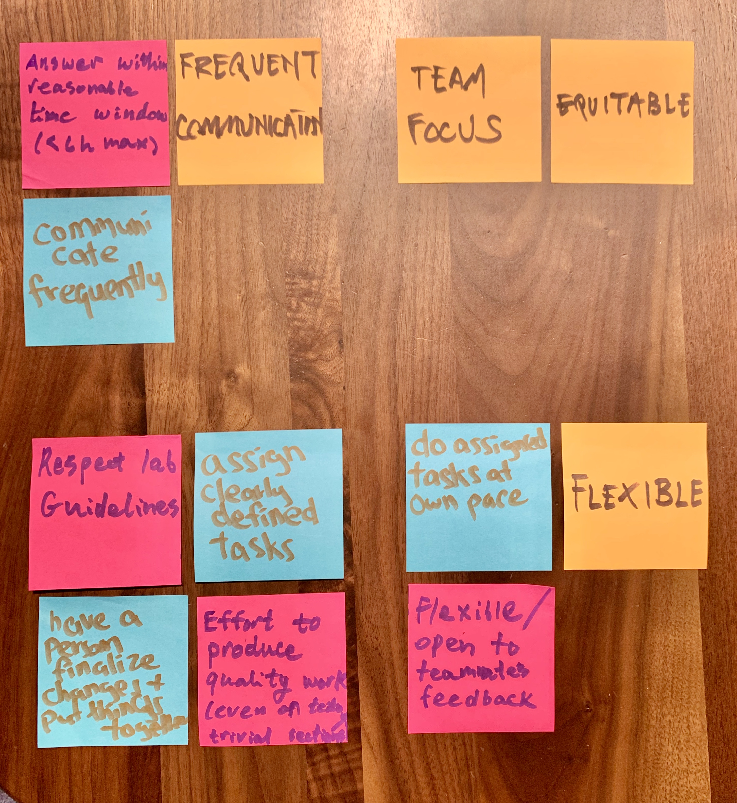

### Introduction

To ensure an efficient, equitable and productive working environment aimed at delivering a high quality project, DSCI 532 Group 109 (“Group 109” or “Team”) of the University of British Columbia Master of Data Science program (“MDS”) has established a Team Work Contract (“Contract”) that provides a guideline for the individual and collective work tasks and responsibilities of its members (“Member”; collectively “Members” or “We”):  

- Robert Blumberg
- Trevor Kwan
- George Thio  

### Inspiration  

  

The results of the first Team meeting on November 21, 2019 shown above capture the broad work principles unanimously agreed upon by the Team

### Guidelines  

We have grouped these work principles into the following four categories:  

    1. Communications
    2. Team Welfare and Equity
    3. Flexibility
    4. Responsibilities and Performance Standards

#### Communications  

- To ensure the project tasks are completed and deadlines are met in a timely manner, we agree to use any form of communication necessary including but not limited to Slack, email, text messaging, voice calls and GitHub Issues  

- In order to consolidate important project related communications in GitHub Issues, but to avoid cluttering the repo with excessive ad-hoc banter, Members shall use their discretion to choose the appropriate form of communication  

- For all formal project contributions, Members shall push contributions to GitHub and make pull requests for another Member to approve and merge

- We do not place restrictions on the days of the week or time of day for ad-hoc communications within the Team members, but mutually agree that prompt  responses are unlikely for communication initiated during the hours of 1:00-9:00 due to daily sleep schedules and routines

#### Team Welfare and Equity  

- We recognize that this project is first and foremost a valuable learning experience and as such seek to divide and assign work responsibilities not only to maximize productivity according to relative Member capabilities, but to also give each Member an opportunity to perform the different work tasks required to produce a successful project (e.g. Dash, Python/Altair, R/ggplot2, presentations)

- For meetings, we agree to rotate the responsibility for setting agendas and taking, editing and pushing meeting notes to the project repo 

- To accommodate unforeseen extenuating circumstances (e.g. personal/family emergencies) and protect the health and welfare of each Team member in good faith, the spirit rather than the letter of this Contract shall always prevail  

#### Flexibility
- We agree to be flexible on working hours and meeting venues and believe that a combination of in-person meetings, online meetings and independent individual work will maximize productivity and quality of the project

- We agree that except in extenuating circumstances (e.g. personal/family emergencies), a minimum initial response time of four hours is expected for any Member requests of a non-urgent nature (i.e not related to a submission deadline on the same day)

- We agree that except in extenuating circumstances (e.g. personal/family emergencies) to strive for a minimum initial response time of one hour for Member requests of an urgent  nature (i.e. related to a submission deadline on the same day)

#### Responsibilities and Performance Standards  

- We agree to clearly and explicitly outline division of work responsibilities to avoid any ambiguity, miscommunication of expectations, or degradation of performance

- We agree to hold each other to the highest standards of performance and ensure each Member is contributing meaningfully and substantially to the goal of achieving an A+ grade for the project

- To ensure the contributions of each Member are equitable with respect to quantity, quality and timeliness, the Team will hold a formal project review at the start of each weekly lab to discuss and immediately remedy any issues in this regard